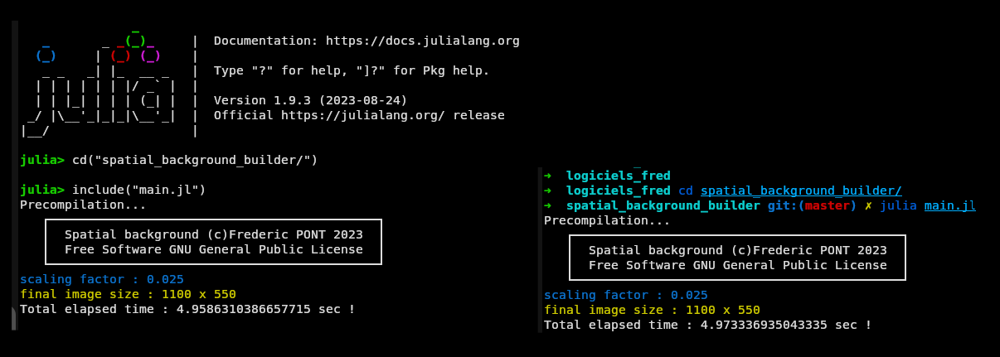

# Spatial Background Builder

Spatial Background Builder is a Julia program to extend [Single-Cell Spatial Explorer](https://github.com/FredPont/spatial) compatibility with [Single-Cell Signature Explorer](https://sites.google.com/site/fredsoftwares/products/single-cell-signature-explorer) or any type of numeric data. It can :
- Computes the image scaling factor and convert cluster(s) column(s) to integers
- Create a black or white background image
- Convert XY coordinates of a scatter plot into pixel coordinates

Example of scRNAseq data (pathways, clusters) obtained with [Single-Cell Signature Explorer](https://sites.google.com/site/fredsoftwares/products/single-cell-signature-explorer) visualized in [Single-Cell Spatial Explorer](https://github.com/FredPont/spatial) after conversion with Spatial Background Builder :

## Manual
- Install [Julia](https://julialang.org) programming language.
- copy the data tables in the data directory. Tables must be formated as follows :
    - TAB separator
    - first lines : column names
    - first column : cell names
    - example : see the test file
- test the software with test files first !
- edit the conf.json file (see bellow more explanations in the configuration section)
- open a terminal or the Julia console
- enter in the Spatial Background Builder using the command "cd" in the terminal or cd() in the Julia console

- start the software with the command julia main.jl or  include("main.jl") in the Julia console
- the black or white background image are in the background directory
- the processed tables are in the result directory
- if the parameter "OptimizeScatterPlot" is set to true, preview scatter plots are in the plots directory

## Configuration
Spatial Background Builder is configured by editing the conf.json file

### Case 1 : spatial transcriptomics data
Edit the following parameters (let default values for other parameters):  
"OptimizeScatterPlot": false,  
"initialImgWidth": 40000,  # the width of the original microscopy image  
"initialImgHeight": 20000,    # the height of the original microscopy image  
"finalImgWidth": 1100,    # the final width of the background image  
"margin": 50,      # the margin in pixel of the final background image  
"IntegerConvert": true, # true if your table contains Floats instead of Integers for the cluster data  
"Cluster": [
        "num_cluster",
        "KEGG_OXIDATIVE_PHOSPHORYLATION"
    ]   # one or more column name used as cluster in the spatial explorer. These columns will be converted to Integers  

### Case 2 : non spatial transcriptomics data, scatter plots...

Edit the following parameters (let default values for other parameters):  
"OptimizeScatterPlot": true,   
"finalImgWidth": 1100,    # the final width of the background image 
"margin": 50,      # the margin in pixel of the final background image 
    "Xcoor": [
        "tSNE_1",
        "GO_MALE_MEIOSIS"
    ],   # one or more column name used as X coordinates  
    "Ycoor": [
        "tSNE_2",
        "GO_MITOCHONDRION"
    ],    # one or more column name used as Y coordinates  
"IntegerConvert": true, # true if your table contains Floats instead of Integers for the cluster   data  
"Cluster": [
        "num_cluster",
        "KEGG_OXIDATIVE_PHOSPHORYLATION"
    ]   # one or more column name used as cluster in the spatial explorer. These columns will be converted to Integers   

